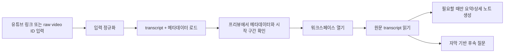

# youtube-crawl

[](https://github.com/bigmacfive/youtube-crawl/actions/workflows/ci.yml)
[](./LICENSE)

[English](./README.md) | 한국어

유튜브 링크를 불러와 출처를 먼저 검증하고, 원문 자막을 읽은 뒤 필요할 때만 요약, 상세 노트, 자막 기반 채팅을 붙이는 로컬 우선 YouTube transcript 워크스페이스입니다. OpenAI, Claude, Google API 키는 사용자가 직접 넣어 쓰는 BYOK 방식입니다.

계정 시스템도 없고, 호스팅된 벡터 저장소도 없고, 처음부터 AI를 돌리지도 않습니다. 기본 원칙은 source first, analysis second 입니다.


## 화면 둘러보기

| 홈 | 프리뷰 |
| --- | --- |
|  |  |

| 워크스페이스 | 설정 |
| --- | --- |
|  |  |

## 설계 원칙

- 분석 전에 먼저 확인합니다. `/preview` 에서 transcript, 메타데이터, 언어, 시작 구간을 먼저 보여주기 때문에 토큰을 쓰기 전에 출처를 검증할 수 있습니다.
- 기본값은 transcript 입니다. `/workspace` 는 raw script 탭으로 열리고, summary, detail, chat은 선택적인 렌즈로만 붙습니다.
- AI는 온디맨드입니다. Summary와 Detail은 첫 진입 시 생성하지 않고, 해당 탭을 열었을 때만 요청합니다.
- 채팅은 증거 기반입니다. 현재 질문과 최근 대화에 맞는 transcript chunk만 골라 보내므로 매 턴마다 전체 자막을 통째로 붙이지 않습니다.
- 저장은 로컬 우선입니다. 워크스페이스 상태, 최근 기록, provider, model, instruction, API 키는 현재 기기의 브라우저 저장소에 남습니다.
- transcript 로딩은 견고하게 처리합니다. watch URL, short URL, Shorts URL, embed URL, raw video ID를 모두 받아들이고, YouTube 클라이언트 전략을 여러 개 시도한 뒤 실패합니다.
- 현재 main 브랜치는 Python 런타임이 필요 없습니다. transcript 로딩은 순수 JavaScript fetcher로 처리합니다.

## 동작 원리

1. 입력을 정규화합니다.
   여러 형태의 YouTube URL이나 raw ID에서 11자리 video ID를 먼저 추출합니다.
2. transcript 와 메타데이터를 병렬로 가져옵니다.
   `/api/transcript` 는 transcript fetcher와 YouTube oEmbed를 동시에 호출한 뒤, 엔티티 정리, timestamp 부여, plain transcript 와 timestamped transcript 생성까지 한 번에 처리합니다.
3. 작업 세트를 로컬에 저장합니다.
   선택한 영상, transcript payload, 생성된 문서, 채팅 기록, 설정은 브라우저 저장소에 캐시되어 같은 기기에서 빠르게 이어서 열 수 있습니다.
4. 긴 transcript 는 chunk-and-merge 로 문서화합니다.
   `/api/assistant` 는 긴 transcript 를 적당한 크기로 쪼개 각 chunk 를 먼저 구조화한 뒤, 이를 최종 summary 또는 detailed reading companion 으로 다시 병합합니다.
5. 채팅은 필요한 근거만 뽑아 답합니다.
   chat 경로는 searchable chunk 를 만들고 간단한 토큰 스코어링으로 관련 chunk 를 고른 뒤, 최근 대화 몇 개만 유지해서 답변과 source preview 를 함께 돌려줍니다.

## 앱 흐름



## 구현 메모

- transcript fetcher 는 순수 JS 로 구현되어 있고, 여러 YouTube client context 를 사용해 caption endpoint 신뢰도를 높입니다.
- transcript payload 에는 raw segment, plain transcript, timestamped transcript, duration, segment count, word count, character count가 함께 들어갑니다.
- summary 와 detail 프롬프트는 자유 형식이 아니라 구조화된 출력 포맷을 강제합니다.
- chat 응답은 transcript 바깥의 추측을 하지 않도록 지시되고, 사실성 있는 주장에는 timestamp 인용을 요구합니다.
- 최근 기록은 video ID 기준으로 저장되기 때문에 같은 영상을 다시 열면 새 항목을 무한히 쌓지 않고 기존 항목을 갱신합니다.

## 기술 스택

- Next.js 16
- React 19
- Tailwind CSS 4
- 순수 JS YouTube transcript fetcher
- OpenAI, Claude, Google BYOK 지원
- Electrobun 데스크톱 패키징 스크립트

## 빠른 시작

필수 환경:

- Node.js 22+
- npm 10+

의존성을 설치합니다.

```bash
npm install
```

개발 서버를 실행합니다.

```bash
npm run dev
```

브라우저에서 [http://localhost:3000](http://localhost:3000)을 엽니다.

## 스크립트

- `npm run dev`: Next.js 개발 서버 실행
- `npm run build`: 프로덕션 빌드 생성
- `npm run lint`: ESLint 실행
- `npm run desktop:dev`: 웹 앱과 Electrobun 셸을 함께 실행
- `npm run desktop:build`: 데스크톱 번들 빌드
- `npm run desktop:run`: 패키징된 데스크톱 엔트리 실행

## 오픈소스 문서

- [기여 가이드](./CONTRIBUTING.md)
- [행동 강령](./CODE_OF_CONDUCT.md)
- [보안 정책](./SECURITY.md)
- [이슈 템플릿](./.github/ISSUE_TEMPLATE)
- [PR 템플릿](./.github/pull_request_template.md)
- [CI 워크플로](./.github/workflows/ci.yml)

## 검증

로컬에서 아래 항목을 확인했습니다.

- `npm run lint`
- `npm run build`

README 스크린샷은 Playwright로 [`scripts/capture-readme-screenshots.mjs`](./scripts/capture-readme-screenshots.mjs)를 사용해 생성했습니다.

## 라이선스

[MIT](./LICENSE)
