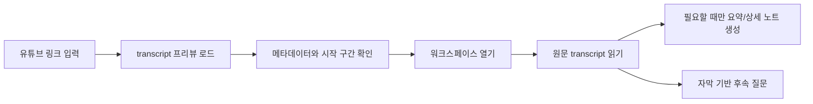

# youtube-crawl

[](https://github.com/bigmacfive/youtube-crawl/actions/workflows/ci.yml)
[](./LICENSE)

[English](./README.md) | 한국어

유튜브 링크를 불러와 메타데이터를 먼저 확인하고, 원문 자막을 읽은 뒤 필요할 때만 요약, 상세 노트, 자막 기반 채팅을 붙일 수 있는 로컬 우선 YouTube transcript 워크스페이스입니다. OpenAI, Claude, Google API 키는 사용자가 직접 넣어 쓰는 방식입니다.


## 왜 이 프로젝트인가

- 분석 전에 먼저 영상 출처와 메타데이터를 확인할 수 있습니다.
- 워크스페이스의 기본값은 항상 원문 transcript 입니다.
- Summary와 Detail은 탭을 열었을 때만 생성됩니다.
- API 키는 로컬 브라우저 저장소에 보관됩니다.
- 최근 작업한 영상과 문서 상태를 현재 기기에 저장합니다.
- 자막 추출은 로컬 Python 워커로 처리합니다.

## 화면 둘러보기

| 홈 | 프리뷰 |
| --- | --- |
|  |  |

| 워크스페이스 | 설정 |
| --- | --- |
|  |  |

## 동작 흐름



## 기술 스택

- Next.js 16
- React 19
- Tailwind CSS 4
- 로컬 Python 워커 + `youtube-transcript-api`
- OpenAI, Claude, Google BYOK 지원

## 빠른 시작

필수 환경:

- Node.js 22+
- npm 10+
- Python 3

의존성과 Python 워커를 준비합니다.

```bash
npm install
npm run setup
```

개발 서버를 실행합니다.

```bash
npm run dev
```

브라우저에서 [http://localhost:3000](http://localhost:3000)을 엽니다.

## 스크립트

- `npm run setup`: `.venv` 생성, Python 의존성 설치, 런타임 설정 파일 생성
- `npm run dev`: Next.js 개발 서버 실행
- `npm run build`: 프로덕션 빌드 생성
- `npm run lint`: ESLint 실행
- `npm run desktop:dev`: 웹 앱과 Electrobun 셸을 함께 실행
- `npm run desktop:build`: 데스크톱 번들 빌드
- `npm run desktop:run`: 패키징된 데스크톱 엔트리 실행

## 오픈소스 문서

- [기여 가이드](./CONTRIBUTING.md)
- [행동 강령](./CODE_OF_CONDUCT.md)
- [보안 정책](./SECURITY.md)
- [이슈 템플릿](./.github/ISSUE_TEMPLATE)
- [PR 템플릿](./.github/pull_request_template.md)
- [CI 워크플로](./.github/workflows/ci.yml)

## 검증

로컬에서 아래 항목을 확인했습니다.

- `npm run setup`
- `npm run lint`
- `npm run build`

README 스크린샷은 Playwright로 [`scripts/capture-readme-screenshots.mjs`](./scripts/capture-readme-screenshots.mjs)를 사용해 생성했습니다.

## 라이선스

[MIT](./LICENSE)
