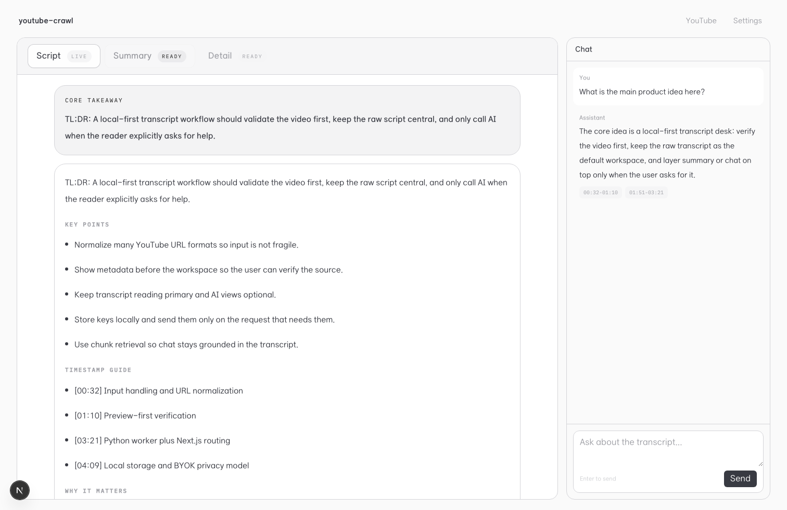
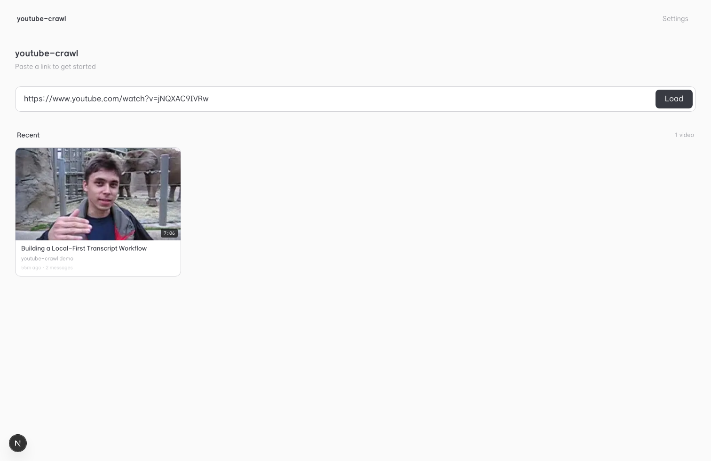
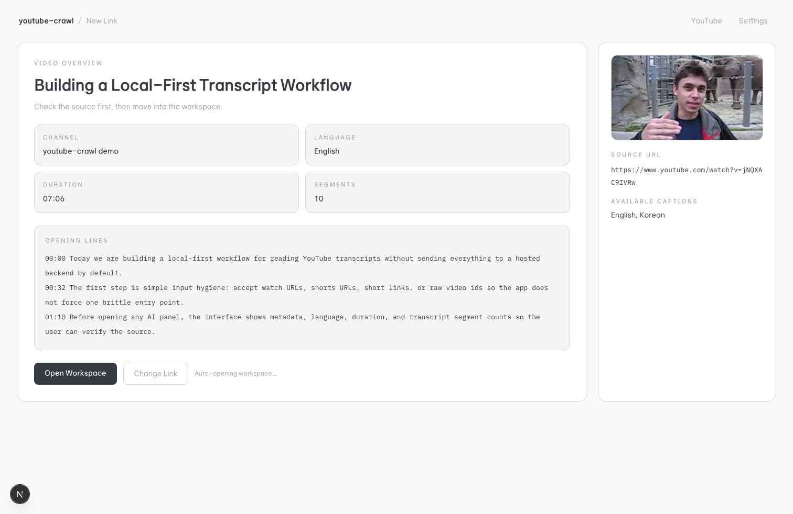
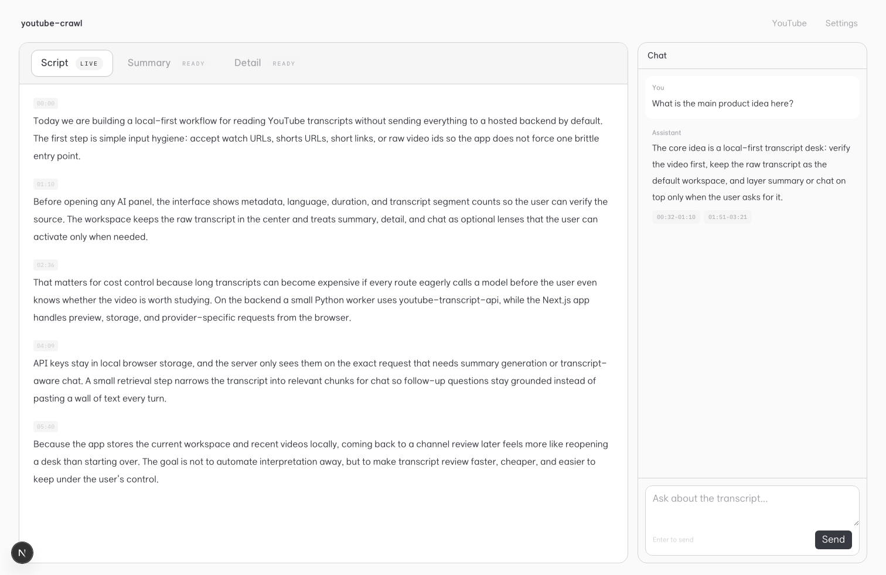
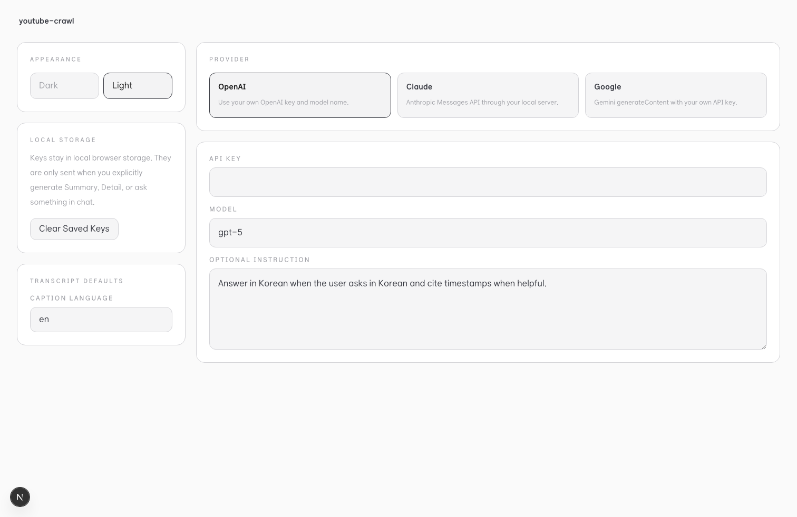
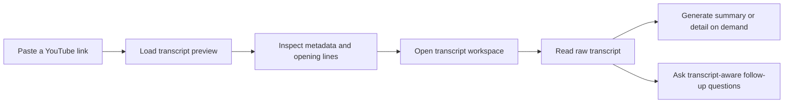

# youtube-crawl

[](https://github.com/bigmacfive/youtube-crawl/actions/workflows/ci.yml)
[](./LICENSE)

English | [한국어](./README.ko.md)

Local-first YouTube transcript desk for loading a video, checking metadata, reading the raw transcript, and optionally generating summary, detail notes, or transcript-aware chat with your own OpenAI, Claude, or Google API key.



## Why youtube-crawl

- Preview the source before spending tokens on analysis.
- Keep the raw transcript as the default workspace.
- Generate summary and detail views only when a tab is opened.
- Bring your own API key and keep it in local browser storage.
- Save recent transcript workspaces on the current device.
- Use a local Python worker for subtitle extraction.

## Product Tour

| Home | Preview |
| --- | --- |
|  |  |

| Workspace | Settings |
| --- | --- |
|  |  |

## App Flow



## Stack

- Next.js 16
- React 19
- Tailwind CSS 4
- `youtube-transcript-api` through a local Python worker
- Bring-your-own OpenAI, Claude, and Google provider support

## Quick Start

Requirements:

- Node.js 22+
- npm 10+
- Python 3

Install dependencies and prepare the Python worker:

```bash
npm install
npm run setup
```

Start the local app:

```bash
npm run dev
```

Open [http://localhost:3000](http://localhost:3000).

## Scripts

- `npm run setup`: create `.venv`, install Python requirements, and write runtime config
- `npm run dev`: start the Next.js development server
- `npm run build`: create a production build
- `npm run lint`: run ESLint
- `npm run desktop:dev`: run the web app and Electrobun shell together
- `npm run desktop:build`: bundle the desktop build
- `npm run desktop:run`: run the packaged desktop entrypoint

## Project Docs

- [Contributing](./CONTRIBUTING.md)
- [Code of Conduct](./CODE_OF_CONDUCT.md)
- [Security Policy](./SECURITY.md)
- [Bug and feature request templates](./.github/ISSUE_TEMPLATE)
- [Pull request template](./.github/pull_request_template.md)
- [CI workflow](./.github/workflows/ci.yml)

## Verification

The repository has been checked locally with:

- `npm run setup`
- `npm run lint`
- `npm run build`

README screenshots were generated with Playwright using [`scripts/capture-readme-screenshots.mjs`](./scripts/capture-readme-screenshots.mjs).

## License

[MIT](./LICENSE)
