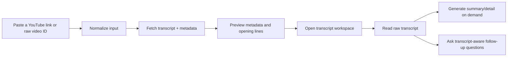

# youtube-crawl

[](https://github.com/bigmacfive/youtube-crawl/actions/workflows/ci.yml)
[](./LICENSE)

English | [한국어](./README.ko.md)

Local-first YouTube transcript desk for loading a video, verifying the source, reading the raw transcript, and only then choosing whether to generate summary, detail notes, or transcript-aware chat with your own OpenAI, Claude, or Google API key.

No account system, no hosted vector store, and no eager AI generation. The default workflow is source first, analysis second.


## Product Tour

| Home | Preview |
| --- | --- |
|  |  |

| Workspace | Settings |
| --- | --- |
|  |  |

## Design Principles

- Preview before analysis. The app loads the transcript, metadata, language, and opening lines on `/preview` so the user can verify the source before spending tokens.
- Transcript first. `/workspace` opens on the raw script tab and treats summary, detail, and chat as optional lenses instead of the default UI.
- On-demand AI only. Summary and detail are requested when their tabs are opened, not during the initial load path.
- Retrieval-grounded chat. The chat route scores transcript chunks against the current question plus recent conversation, then sends only the relevant evidence instead of the full transcript every turn.
- Local-first persistence. Workspace state, recent history, provider choice, model names, instructions, and API keys stay in browser local storage on the current device.
- Resilient transcript loading. The input parser accepts watch URLs, short URLs, Shorts URLs, embed URLs, and raw video IDs, then the fetcher tries multiple YouTube client strategies before failing.
- No Python runtime on the current main branch. Transcript loading now uses a pure JavaScript fetcher against YouTube endpoints.

## How It Works

1. Normalize the input.
   The app extracts a valid 11-character video ID from multiple YouTube URL formats or a raw ID.
2. Fetch transcript and metadata in parallel.
   `/api/transcript` calls the transcript fetcher and YouTube oEmbed together, then cleans entities, decorates segments with timestamps, and builds plain plus timestamped transcript text.
3. Persist the working set locally.
   The selected video, transcript payload, generated documents, chat history, and settings are cached in browser storage so the workspace can be reopened quickly on the same machine.
4. Generate long-form documents with chunk-and-merge.
   `/api/assistant` splits long transcripts into bounded chunks, generates structured notes for each chunk, and merges them into one summary or detailed reading companion in the requested language.
5. Answer chat questions with targeted evidence.
   The chat path builds searchable transcript chunks, ranks them with lightweight token scoring, keeps only the latest conversation history, and returns source previews alongside the answer.

## App Flow



## Technical Notes

- Transcript fetching is implemented in pure JS and uses YouTube caption endpoints with multiple client contexts to improve reliability.
- The transcript payload includes raw segments, plain transcript text, timestamped transcript text, and derived stats such as duration, segment count, word count, and character count.
- Summary and detail prompts enforce a structured output format instead of free-form dumping.
- Chat answers are instructed to stay inside transcript evidence and cite timestamps for factual claims.
- Recent history is keyed by video ID so revisiting the same video updates the existing saved entry instead of duplicating it.

## Stack

- Next.js 16
- React 19
- Tailwind CSS 4
- Pure JS YouTube transcript fetcher
- Bring-your-own OpenAI, Claude, and Google provider support
- Electrobun desktop shell scripts for desktop packaging

## Quick Start

Requirements:

- Node.js 22+
- npm 10+

Install dependencies:

```bash
npm install
```

Start the local app:

```bash
npm run dev
```

Open [http://localhost:3000](http://localhost:3000).

## Scripts

- `npm run dev`: start the Next.js development server
- `npm run build`: create a production build
- `npm run lint`: run ESLint
- `npm run desktop:dev`: run the web app and Electrobun shell together
- `npm run desktop:build`: bundle the desktop build
- `npm run desktop:run`: run the packaged desktop entrypoint

## Project Docs

- [Contributing](./CONTRIBUTING.md)
- [Code of Conduct](./CODE_OF_CONDUCT.md)
- [Security Policy](./SECURITY.md)
- [Bug and feature request templates](./.github/ISSUE_TEMPLATE)
- [Pull request template](./.github/pull_request_template.md)
- [CI workflow](./.github/workflows/ci.yml)

## Verification

The repository has been checked locally with:

- `npm run lint`
- `npm run build`

README screenshots were generated with Playwright using [`scripts/capture-readme-screenshots.mjs`](./scripts/capture-readme-screenshots.mjs).

## License

[MIT](./LICENSE)
